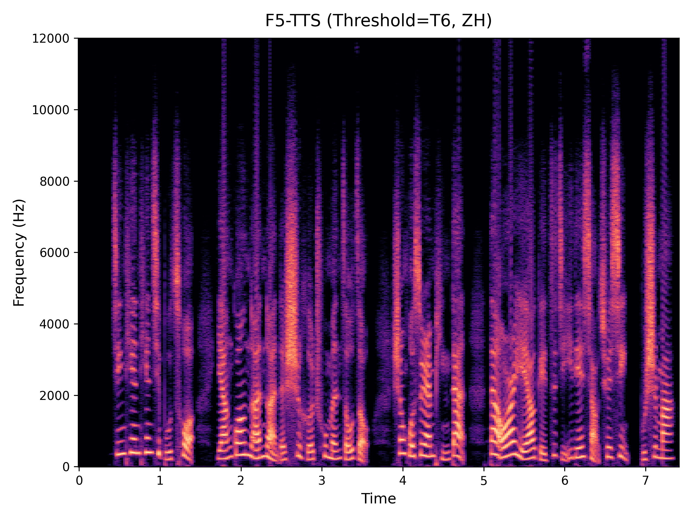

# DiTReducio 
A calibration and acceleration tool for DiT-Based TTS models.

Audio demos for different thresholds are available in the `assets` folder.

## Audio Demos and Spectrograms

The following showcases audio samples and their corresponding spectrograms across different models, languages, and threshold values.

### F5-TTS (English)

<table>
  <tr>
    <th>Threshold</th>
    <th>Audio</th>
    <th>Spectrogram</th>
  </tr>
  <tr>
    <td>None</td>
    <td><audio controls src="assets/f5-tts_en/infer_cli_None.wav"></audio></td>
    <td></td>
  </tr>
  <tr>
    <td>0.05</td>
    <td><audio controls src="assets/f5-tts_en/infer_cli_0.05.wav"></audio></td>
    <td></td>
  </tr>
  <tr>
    <td>0.1</td>
    <td><audio controls src="assets/f5-tts_en/infer_cli_0.1.wav"></audio></td>
    <td></td>
  </tr>
  <tr>
    <td>0.15</td>
    <td><audio controls src="assets/f5-tts_en/infer_cli_0.15.wav"></audio></td>
    <td></td>
  </tr>
  <tr>
    <td>0.2</td>
    <td><audio controls src="assets/f5-tts_en/infer_cli_0.2.wav"></audio></td>
    <td></td>
  </tr>
  <tr>
    <td>0.25</td>
    <td><audio controls src="assets/f5-tts_en/infer_cli_0.25.wav"></audio></td>
    <td></td>
  </tr>
  <tr>
    <td>0.3</td>
    <td><audio controls src="assets/f5-tts_en/infer_cli_0.3.wav"></audio></td>
    <td></td>
  </tr>
</table>

### F5-TTS (Chinese)

<table>
  <tr>
    <th>Threshold</th>
    <th>Audio</th>
    <th>Spectrogram</th>
  </tr>
  <tr>
    <td>None</td>
    <td><audio controls src="assets/f5-tts_zh/infer_cli_None.wav"></audio></td>
    <td></td>
  </tr>
  <tr>
    <td>0.05</td>
    <td><audio controls src="assets/f5-tts_zh/infer_cli_0.05.wav"></audio></td>
    <td></td>
  </tr>
  <tr>
    <td>0.1</td>
    <td><audio controls src="assets/f5-tts_zh/infer_cli_0.1.wav"></audio></td>
    <td></td>
  </tr>
  <tr>
    <td>0.15</td>
    <td><audio controls src="assets/f5-tts_zh/infer_cli_0.15.wav"></audio></td>
    <td></td>
  </tr>
  <tr>
    <td>0.2</td>
    <td><audio controls src="assets/f5-tts_zh/infer_cli_0.2.wav"></audio></td>
    <td></td>
  </tr>
  <tr>
    <td>0.25</td>
    <td><audio controls src="assets/f5-tts_zh/infer_cli_0.25.wav"></audio></td>
    <td></td>
  </tr>
  <tr>
    <td>0.3</td>
    <td><audio controls src="assets/f5-tts_zh/infer_cli_0.3.wav"></audio></td>
    <td></td>
  </tr>
</table>

### MegaTTS 3 (English)

<table>
  <tr>
    <th>Threshold</th>
    <th>Audio</th>
    <th>Spectrogram</th>
  </tr>
  <tr>
    <td>None</td>
    <td><audio controls src="assets/megatts3_en/out_None.wav"></audio></td>
    <td></td>
  </tr>
  <tr>
    <td>0.2</td>
    <td><audio controls src="assets/megatts3_en/out_0.2.wav"></audio></td>
    <td></td>
  </tr>
  <tr>
    <td>0.4</td>
    <td><audio controls src="assets/megatts3_en/out_0.4.wav"></audio></td>
    <td></td>
  </tr>
  <tr>
    <td>0.6</td>
    <td><audio controls src="assets/megatts3_en/out_0.6.wav"></audio></td>
    <td></td>
  </tr>
  <tr>
    <td>0.8</td>
    <td><audio controls src="assets/megatts3_en/out_0.8.wav"></audio></td>
    <td></td>
  </tr>
  <tr>
    <td>1.0</td>
    <td><audio controls src="assets/megatts3_en/out_1.0.wav"></audio></td>
    <td></td>
  </tr>
  <tr>
    <td>1.2</td>
    <td><audio controls src="assets/megatts3_en/out_1.2.wav"></audio></td>
    <td></td>
  </tr>
</table>

### MegaTTS 3 (Chinese)

<table>
  <tr>
    <th>Threshold</th>
    <th>Audio</th>
    <th>Spectrogram</th>
  </tr>
  <tr>
    <td>None</td>
    <td><audio controls src="assets/megatts3_zh/out_None.wav"></audio></td>
    <td></td>
  </tr>
  <tr>
    <td>0.2</td>
    <td><audio controls src="assets/megatts3_zh/out_0.2.wav"></audio></td>
    <td></td>
  </tr>
  <tr>
    <td>0.4</td>
    <td><audio controls src="assets/megatts3_zh/out_0.4.wav"></audio></td>
    <td></td>
  </tr>
  <tr>
    <td>0.6</td>
    <td><audio controls src="assets/megatts3_zh/out_0.6.wav"></audio></td>
    <td></td>
  </tr>
  <tr>
    <td>0.8</td>
    <td><audio controls src="assets/megatts3_zh/out_0.8.wav"></audio></td>
    <td></td>
  </tr>
  <tr>
    <td>1.0</td>
    <td><audio controls src="assets/megatts3_zh/out_1.0.wav"></audio></td>
    <td></td>
  </tr>
  <tr>
    <td>1.2</td>
    <td><audio controls src="assets/megatts3_zh/out_1.2.wav"></audio></td>
    <td></td>
  </tr>
</table>


## Supported Models
- F5-TTS
- MegaTTS 3

## Installation
```bash
git clone https://github.com/i11box/DiTReducio.git # clone the repository
```

- F5-TTS
  
  For F5-TTS, place the corresponding version files in the F5-TTS model root directory.
- MegaTTS 3
  
  For MegaTTS 3, place the corresponding version files in the `tts` folder of MegaTTS 3 model.

> Note: The paths in code should be adjusted according to your environment.

## Usage
```bash
python fast_cli.py # Launch
python fast_cli.py -q true -d <threshold> # Calibration, -q true enable calibration, -d <threshold> set threshold value
python fast_cli.py -d <threshold> # Acceleration
```